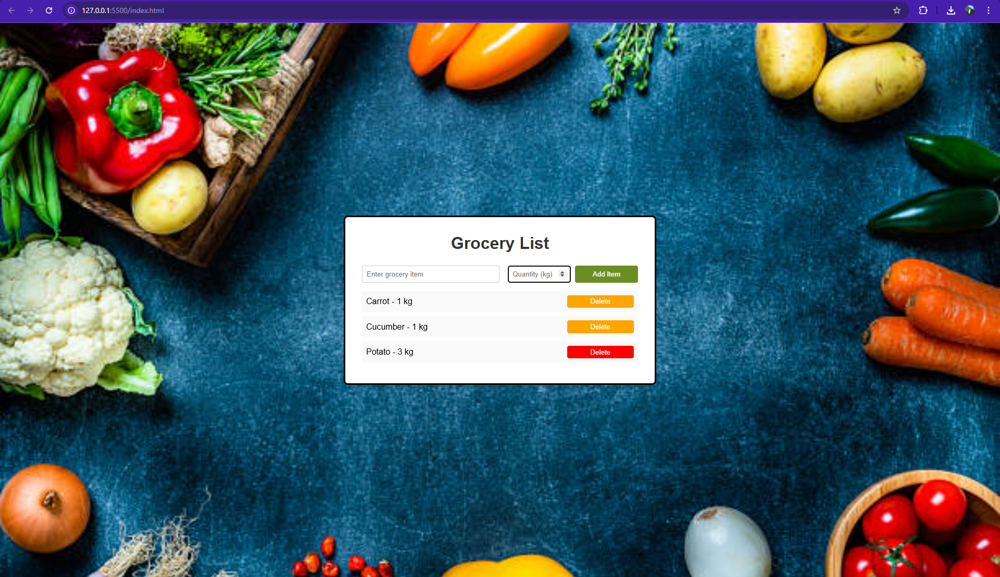

# Simple Grocery List Application

This is a basic grocery list page created with HTML, CSS, and JavaScript. It allows users to add grocery items along with quantities, view the list, and delete items as needed.

## Technologies Used

- **HTML**
- **CSS**
- **JavaScript**

## Project Structure

- **index.html**: Contains the HTML structure.
- **style.css**: Provides styles, including layout, colors, and button designs.
- **script.js**: Includes JavaScript code for handling item addition, deletion, and list management.

## Screenshots

